**Overview**

This diagram shows the Hub's high-level architecture and how the components described in the KB (channel adapters, runtime execution, PI integration, registries, and persistence) interact to satisfy the requirements for deterministic session mapping, adapter parity, sandboxed execution, and observability.

```mermaid
flowchart LR
  subgraph Clients
    WebClient["Web UI (Vercel AI SDK client)"]
    ExtChannels[("External Channels\nWhatsApp / Telegram / SMS")]
  end

  subgraph Gateway
    Ingress["Channel Gateway / HTTP Routes"]
    WebAdapter["WebAdapter (server-side shim)"]
    WhatsAppAdapter["WhatsAppAdapter"]
    TelegramAdapter["TelegramAdapter"]
  end

  subgraph Runtime
    Router["Runtime Routing / Channel Normalizer"]
    SessionMap[("ChatProviderSession DB")]
    ChatRuntime["executeRuntimeChatTurn"]
    PolicyExec["Guarded Executor / Allowlist & Caps"]
  end

  subgraph Execution
    ExecFrame["Execution Frame / Context"]
    AgentDef["Agent Definition (manifests)"]
    SkillLoader["Skill Loader / Sandbox Provisioner"]
    RepoIndex["Repo Files (indexed knowledge)"]
    EphemeralMem["Ephemeral Memory (per-turn/session)"]
    ToolBindings["Tool Bindings & Credentials"]
  end

  subgraph PI
    PIRegistry["ModelRegistry / SessionManager"]
    PICore["pi-agent-core / pi-ai"]
    PICoding["pi-coding-agent (embedded UI/runtime)"]
  end

  subgraph Infra
    DB[("Postgres / Drizzle DB")]
    ObjectStore[("Vercel Blob / S3")]
    Observability["OpenTelemetry / Audit Logs"]
    ProviderConfig["Provider Configs & Secrets"]
  end

  subgraph P2P
    Sidecar["P2P Sidecar (local)"]
    P2PNetwork[("Peer-to-peer Network")]
    OIDCProvider["OIDC Provider (Peerturest)"]
    RemoteHandoff["Remote Handoff Protocol\n(Signaling & Token Handover)"]
  end

  WebClient -->|"client events"| Ingress
  ExtChannels -->|"webhooks"| Ingress

  Ingress --> Router
  Router --> WebAdapter
  Router --> WhatsAppAdapter
  Router --> TelegramAdapter

  Router -->|"resolve session"| SessionMap
  Router --> ChatRuntime

  ChatRuntime -->|"enter execution"| ExecFrame
  ExecFrame -->|"load agent"| AgentDef
  ExecFrame -->|"load skill"| SkillLoader
  ExecFrame -->|"read knowledge"| RepoIndex
  ExecFrame -->|"use ephemeral"| EphemeralMem
  ExecFrame -->|"policy check"| PolicyExec

  SkillLoader -->|"provision sandbox"| PIRegistry
  AgentDef -->|"register"| PIRegistry
  RepoIndex -->|"indexed content"| PIRegistry

  PolicyExec -->|"resolve creds"| ToolBindings
  ToolBindings -->|"provide creds"| ExecFrame

  PIRegistry --> PICore
  PICore --> PICoding

  ChatRuntime --> DB
  SessionMap --> DB
  ProviderConfig --> PIRegistry

  Observability -->|"trace exec frame"| ExecFrame
  Observability -->|"traces & audit"| PICore
  Observability -->|"traces"| ChatRuntime
  ObjectStore -->|"attachments"| DB

  Sidecar -->|"peer discovery"| P2PNetwork
  Ingress -->|"optional local forward"| Sidecar
  Sidecar -->|"authenticate"| OIDCProvider
  Sidecar -->|"handoff"| RemoteHandoff
  RemoteHandoff -->|"session tokens"| SessionMap
  P2PNetwork -->|"attachments/streams"| ObjectStore

  style SessionMap fill:#333,stroke:#333,stroke-width:1px
  style PIRegistry fill:#444,stroke:#333,stroke-width:1px
  style PolicyExec fill:#555,stroke:#333,stroke-width:1px
```

- DB / `ChatProviderSession`: persist mapping so a single chat keeps the same PI session when appropriate.

How this fulfills requirements

- Deterministic session mapping: the `SessionMap` ensures chat → PI session determinism across adapters and server restarts.
- Adapter parity: server-side `WebAdapter` plus adapter interfaces guarantee the same normalized model for web and external channels.
- Sandboxing & safety: the `PolicyExec` layer centralizes allowlists and caps, preventing untrusted skills from performing side-effects without checks.
- Observability & auditability: traces from `ChatRuntime` and `PI` flows are collected by OpenTelemetry and audit logs for post-hoc review.

Execution context: how `executeRuntime` composes the runtime

- Agent definition (bootstrap + evolutionary adding): agents are described by a small manifest (id, version, declared skills, signing metadata). The runtime boots with a set of pre-approved agent manifests and can dynamically load additional signed agent bundles from `PIRegistry` or a trusted artifact store. Newly added agents are validated (signature, policy checks) before being made available to `executeRuntime`.
- Skill definition and loading: skills are packaged code/artifacts with a declarative `skill.json` (capabilities, API surface, required resources) and one or more entrypoint scripts. `PIRegistry` loads skill metadata, performs static safety checks, and provisions isolated execution sandboxes (worker processes, containers, or WASM VMs) where skill scripts run with strictly limited tool bindings.
- Role of files in the working git repo: repository files act as a first-class knowledge bundle; selected repo paths can be indexed and exposed as read-only knowledge to agents (via an indexed search/embedding service or a virtual read-only filesystem). File provenance (git commit, path) is recorded so agents can cite sources and the system can re-index on repo updates. Only allowlisted repo areas are exposed to avoid leaking secrets.
- Ephemeral memory: `executeRuntime` maintains per-turn and per-session ephemeral memory (in-process or cached in Redis) for short-lived context (recent messages, tool call results, ephemeral keys). Ephemeral memory is not persisted by default; persistent state must be explicitly committed to `ChatProviderSession` or DB by an approved action.
- Tool bindings, credentials, and policy: the execution context includes a table of allowed tool bindings and credentials (scoped tokens, mTLS creds) resolved from `ProviderConfig` and the OIDC provider. `PolicyExec` enforces allowlists, caps, and token scope checks before any skill or agent call that performs side effects.
- Observability & auditing in-context: each execution frame is traced and logged with a unique execution id; tool calls, handoffs, and token exchanges are recorded to audit logs and OpenTelemetry spans for replay and forensic review.
- Missing/other considerations: key rotation, revocation (for handoff tokens), deterministic replay hooks for debugging, and reconciliation jobs for failed remote handoffs are integral to a production-ready execution context.

If you'd like, I can also: (a) export this diagram as an image, (b) add a second diagram showing data persistence and migration steps for `ChatProviderSession`, or (c) produce a one-page `design.md` draft that expands these sections into the KB feature folder.
